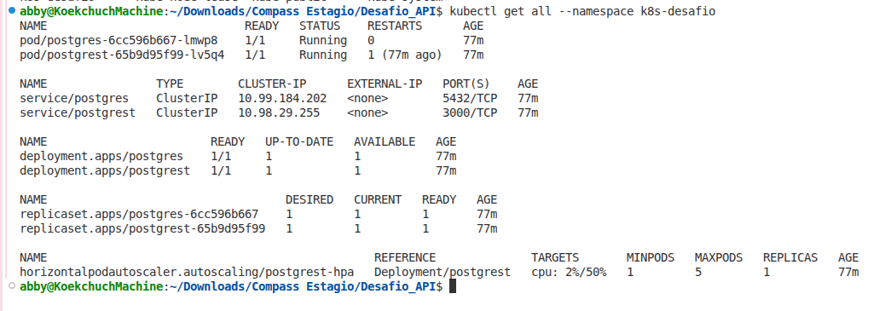
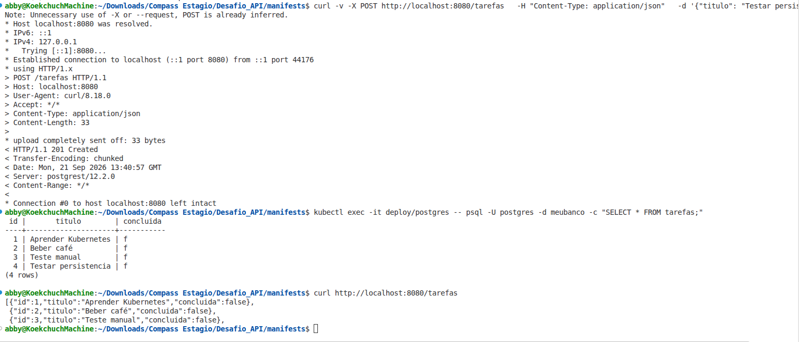
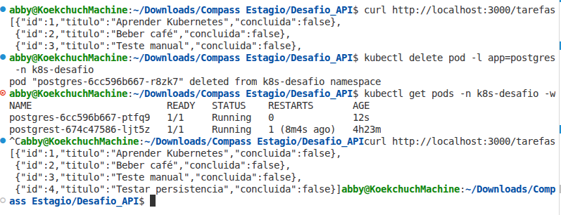
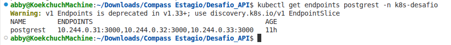
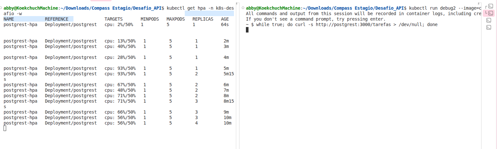
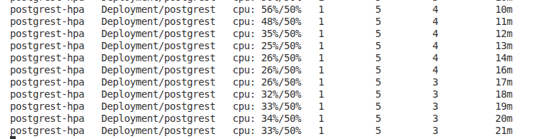

# k8s-postgrest-postgres-challenge

Desafio de Fundamentos de Kubernetes — CloudOps Bootcamp S7. Implantação de uma API (PostgREST) integrada a um banco de dados (PostgreSQL) em um cluster Kubernetes local, com persistência de dados comprovada.

## Objetivo

Implantar, do zero, uma aplicação integrada a um banco de dados em um cluster Kubernetes local, aplicando os principais conceitos de orquestração de contêineres: Pods, Deployments, Services, ConfigMaps, Secrets, Volumes persistentes, Namespaces, probes de saúde e escalonamento (manual e automático).

## Arquitetura

```
Você (curl) → Service (postgrest) → Deployment PostgREST → Service (postgres) → Deployment PostgreSQL + PVC
```

A API (PostgREST) se conecta ao banco pelo **nome do Service** do PostgreSQL (DNS interno do cluster), nunca pelo IP do Pod — essa é a peça-chave da integração: um recurso encontra o outro pelo Service, mesmo que os Pods sejam recriados e mudem de IP.

## Stack

- **Banco:** `postgres:16`
- **API:** `postgrest/postgrest:v12.2.0` — expõe automaticamente uma API REST completa sobre qualquer tabela do PostgreSQL
- **Cluster local:** minikube

## Pré-requisitos

- `kubectl` instalado e configurado
- minikube instalado, com um cluster ativo (`minikube start`)
- Para o Nível 7 (HPA): metrics-server habilitado — `minikube addons enable metrics-server`. Sem isso, o HPA é criado mas fica com métricas `<unknown>` e não escala.

## Estrutura do repositório

```
manifests/
├── 00-namespace/
│   └── namespace-k8s.yaml
├── 01-postgres/
│   ├── postgres-configmap.yaml
│   ├── postgres-deployment.yaml
│   ├── postgres-init-configmap.yaml   # cria a role restrita web_anon na primeira inicialização
│   ├── postgres-pvc.yaml
│   ├── postgres-secret.yaml.example   # template — o real está no .gitignore
│   └── postgres-service.yaml
├── 02-api/
│   ├── postgrest-deployment.yaml
│   └── postgrest-service.yaml
└── 03-scaling/
    └── postgrest-hpa.yaml
docs/
└── decisoes-descartadas/    # manifests de StatefulSet, descartados em favor de Deployment (ver seção de decisões)
```

## Como reproduzir — passo a passo

### 1. Preparar o cluster

```bash
minikube start
kubectl get nodes   # confirme que há um nó em Ready
```

### 2. Criar as credenciais do banco

Copie `manifests/01-postgres/postgres-secret.yaml.example` para `postgres-secret.yaml` na mesma pasta e preencha com um usuário/senha próprios. Esse arquivo é ignorado pelo Git (`.gitignore`) e nunca deve ser versionado.

### 3. Subir tudo de uma vez

```bash
kubectl apply -f manifests/ -R
```

Isso cria, em sequência lógica: o Namespace, o PostgreSQL (PVC + ConfigMap + Secret + Deployment + Service), a API PostgREST (Deployment + Service) e o HPA.

### 4. Confirmar que tudo subiu

```bash
kubectl get all -n k8s-desafio
```

Todos os Pods devem aparecer como `Running`.

### 5. Criar uma tabela de teste no banco

```bash
kubectl exec -it deploy/postgres -n k8s-desafio -- psql -U postgres -d meubanco -c \
  "CREATE TABLE tarefas (id SERIAL PRIMARY KEY, titulo TEXT NOT NULL, concluida BOOLEAN DEFAULT false);"
```

### 6. Testar a integração API ↔ banco

```bash
kubectl port-forward svc/postgrest 3000:3000 -n k8s-desafio
```

Em outro terminal:

```bash
# Ler dados (GET)
curl http://localhost:3000/tarefas

# Inserir um dado (POST)
curl -X POST http://localhost:3000/tarefas \
  -H "Content-Type: application/json" \
  -d '{"titulo": "Testar persistencia"}'
```

Se o `POST` funcionar e o `GET` seguinte mostrar o item criado, a API encontrou o banco através do Service — a integração está provada.

> **Nota sobre `web_anon`:** a role `web_anon`, usada pelo PostgREST para acesso anônimo restrito, é criada automaticamente pelo `postgres-init-configmap.yaml` apenas na **primeira inicialização de um PVC vazio** (é assim que a imagem oficial `postgres:16` trata scripts em `/docker-entrypoint-initdb.d/`). Se você reaproveitar um PVC que já existia antes dessa role ser adicionada, crie-a manualmente uma única vez:
> ```bash
> kubectl exec -it deploy/postgres -n k8s-desafio -- psql -U postgres -d meubanco -c \
>   "CREATE ROLE web_anon NOLOGIN; GRANT USAGE ON SCHEMA public TO web_anon; GRANT SELECT, INSERT, UPDATE, DELETE ON tarefas TO web_anon; GRANT USAGE, SELECT ON SEQUENCE tarefas_id_seq TO web_anon;"
> ```

### 7. Testar a persistência dos dados

```bash
# 1. Confirme os dados atuais
curl http://localhost:3000/tarefas

# 2. Delete o Pod do banco
kubectl delete pod -l app=postgres -n k8s-desafio

# 3. Espere o novo Pod ficar pronto
kubectl get pods -n k8s-desafio -w

# 4. Confirme que os mesmos dados continuam lá
curl http://localhost:3000/tarefas
```

Como o volume é um `PersistentVolumeClaim` (não um `emptyDir`), os dados sobrevivem à recriação do Pod.

### 8. Testar health checks e escala manual

```bash
kubectl scale deployment postgrest --replicas=3 -n k8s-desafio
kubectl get endpoints postgrest -n k8s-desafio
```

A saída deve mostrar 3 IPs diferentes — um por réplica — confirmando que o Service está balanceando o tráfego entre elas.

### 9. Testar o autoscaling (HPA — bônus)

Em um terminal, acompanhe o HPA:

```bash
kubectl get hpa -n k8s-desafio -w
```

Em outro, gere carga de dentro do cluster:

```bash
kubectl run debug --image=curlimages/curl -n k8s-desafio --rm -it -- sh
# dentro do Pod:
while true; do curl -s http://postgrest:3000/tarefas > /dev/null; done
```

Observe o `REPLICAS` do HPA subindo conforme o `TARGET` (uso de CPU) ultrapassa 50%. Pare o loop (`Ctrl+C`, depois `exit`) e continue observando — o HPA reduz as réplicas de volta sozinho após alguns minutos sem carga.

### 10. Limpar o ambiente

```bash
kubectl delete namespace k8s-desafio
```

Isso remove todos os recursos do desafio de uma vez, incluindo o PVC (e o PV por trás dele, já que a StorageClass padrão do minikube usa política `Delete`).

## Decisões de arquitetura

**StatefulSet vs. Deployment para o PostgreSQL:** o enunciado do desafio pede `Deployment` + `PersistentVolumeClaim`, que é o que foi implementado aqui. Uma primeira versão usou `StatefulSet`, que é considerado a prática recomendada para bancos de dados em produção — ele garante um PVC dedicado e estável por Pod (via `volumeClaimTemplates`), identidade de rede fixa e ordem de inicialização. Com `replicas: 1`, o `Deployment` atende bem ao objetivo do desafio (persistência de dados via PVC), mas essa é uma limitação a se ter em mente ao evoluir para um cenário multi-réplica de banco. Os manifests da versão descartada ficam documentados em `docs/decisoes-descartadas/`.

**`PGRST_DB_ANON_ROLE` restrita:** inicialmente a role anônima do PostgREST estava configurada como `postgres` (superusuário), o que dava acesso total ao banco sem autenticação — funcional, mas não recomendado fora de um ambiente de teste. Isso foi corrigido criando uma role dedicada, `web_anon`, com `NOLOGIN` (não pode autenticar diretamente, só é usada internamente pelo PostgREST) e permissões restritas apenas ao necessário (`SELECT`, `INSERT`, `UPDATE`, `DELETE` na tabela `tarefas`, mais acesso à sequence do `id`). A criação da role é automatizada via `postgres-init-configmap.yaml`, montado em `/docker-entrypoint-initdb.d/` no container do Postgres — script executado automaticamente pela imagem oficial na primeira inicialização de um volume vazio.

## Evidências

**1. `kubectl get all` do namespace completo, mostrando todos os recursos (Pods, Services, Deployments, ReplicaSets) rodando:**



Visão geral do namespace k8s-desafio após a implantação. O print comprova que os Deployments do PostgreSQL e do PostgREST estão com o status READY 1/1, os Services estão ativos com seus respectivos ClusterIPs, e os ReplicaSets foram criados corretamente pelo Kubernetes. É a linha de base que prova que toda a infraestrutura subiu conforme o planejado.

**2. A API respondendo com dados vindos do banco (prova da integração PostgREST ↔ PostgreSQL):**


1. Realizei um POST /tarefas para criar um novo registro. A API retornou HTTP/1.1 201 Created, confirmando a escrita no banco.

2. Em seguida, acessei o Pod do PostgreSQL via kubectl exec e executei um SELECT * FROM tarefas. O registro criado (id=4, titulo="Testar persistencia") está fisicamente no banco de dados.

3. Por fim, executei um GET /tarefas na API. O retorno em JSON contém os 4 registros, provando que a API está lendo os dados diretamente do banco através do Service DNS postgres.


**3. Persistência: mesmo dado (incluindo o inserido via POST) acessível pela API antes e depois de deletar o Pod do PostgreSQL, num único print mostrando a sequência completa (curl → delete pod → get pods → curl novamente):**



Teste de resiliência e persistência de dados. A sequência demonstra que os dados sobrevivem à destruição do Pod:

1. A API retorna os dados normalmente.

2. O Pod do PostgreSQL é deletado com kubectl delete pod (simulando uma falha ou reinicialização).

3. O Kubernetes recria o Pod automaticamente.

4. A API é consultada novamente e retorna os mesmos dados, incluindo o registro inserido via POST. Isso prova que o PersistentVolumeClaim (PVC) manteve os dados intactos, independentemente do ciclo de vida do Pod.

**4. `kubectl get endpoints postgrest`, mostrando os IPs das 3 réplicas atrás do Service (prova de balanceamento de carga):**



Prova de balanceamento de carga e escalabilidade. O comando mostra que o Service postgrest tem 3 endpoints (IPs de Pods) registrados. Isso significa que o Service está distribuindo o tráfego HTTP entre as 3 réplicas da API, garantindo alta disponibilidade e melhor desempenho. (Nota: O comando get endpoints está obsoleto na versão atual do K8s, mas o print serve perfeitamente para o propósito de demonstrar o balanceamento).

**5. HPA escalando automaticamente sob carga — print mostrando `kubectl get hpa -w` com o `TARGET` subindo e `REPLICAS` aumentando (ex: de 1 para 4), lado a lado com o terminal gerando a carga:**





Teste de autoescalonamento (Horizontal Pod Autoscaler). O script em loop (while true; do curl...) gerou carga constante na API. O HPA monitorou o uso de CPU, que ultrapassou a meta de 50%, e escalou automaticamente o Deployment de 1 para 4 réplicas. Após a carga cessar, o HPA reduziu o número de réplicas de volta para 1, otimizando o uso de recursos do cluster.

## Reflexões

### Nível 1 — Namespace e primeiro contato

Pod é a menor unidade do Kubernetes, agrupando um ou mais containers que compartilham rede e armazenamento. Um Pod criado sozinho não tem autocura: se for deletado ou falhar, nada o recria, pois não há um controlador responsável por ele. É por isso que raramente criamos Pods diretamente — usamos Deployments, que gerenciam um ReplicaSet por baixo dos panos. O ReplicaSet garante que sempre exista o número desejado de réplicas rodando, recriando Pods automaticamente quando necessário. O Deployment vai além disso, adicionando controle de rollout: atualizações graduais (rolling update) e a capacidade de reverter (rollback) para uma versão anterior caso algo dê errado.

### Nível 2 — Banco de dados com persistência

O `emptyDir` é um volume cujo ciclo de vida está atrelado ao Pod: ele é criado vazio quando o Pod sobe e é destruído permanentemente quando o Pod é removido, seja por deleção manual, crash, ou recriação automática pelo Deployment. Os dados ficam num diretório temporário no disco do próprio nó, gerenciado pelo kubelet, sem existência própria fora do Pod. Já o `PersistentVolumeClaim` desacopla o armazenamento do ciclo de vida do Pod. O PVC existe como um recurso independente no cluster: quando o Pod é deletado e recriado, o novo Pod simplesmente monta o mesmo PVC, encontrando os dados exatamente como foram deixados.

### Nível 3 — Configuração e segredos

Base64 é apenas codificação (uma representação alternativa dos mesmos bytes), não criptografia. Qualquer um com acesso ao `kubectl get secret -o yaml` roda `echo <valor> | base64 -d` e tem a senha em texto puro na hora. O Secret não protege de quem já tem acesso ao cluster (via `kubectl` ou API); ele protege de duas coisas mais específicas: não deixar a senha hardcoded e versionada dentro do YAML do Deployment, e permitir controle de acesso via RBAC, restringindo quem pode ler Secrets separadamente de quem pode ler outros recursos. Em produção real, a proteção de verdade vem de coisas como criptografia em repouso no etcd (*encryption at rest*), soluções externas como Vault/Sealed Secrets, e RBAC bem configurado.

### Nível 4 — A API conectada ao banco (a integração)

Se a conexão usasse o IP do Pod diretamente, qualquer recriação do Pod (por crash, atualização, ou o Deployment simplesmente escalando) quebraria a conexão — o novo Pod nasce com um IP diferente, e o IP antigo pode inclusive ser reatribuído a outro Pod completamente diferente, causando erros silenciosos de conexão para o lugar errado. Usando o nome do Service, esse problema desaparece: o Service tem um endereço DNS fixo e estável, e por trás dele usa um `selector` de labels para saber automaticamente quais Pods atuais devem receber o tráfego. Como o Deployment sempre recria Pods com as mesmas labels, o Service nunca perde de vista o Pod correto, independente de quantas vezes ele seja destruído e recriado, ou de qual IP novo receba.

### Nível 5 — Expor a API e provar a persistência

Vários componentes tiveram que atuar em conjunto para que o dado sobrevivesse. O PVC foi a peça central: ele existe de forma independente do ciclo de vida do Pod, então quando o Pod antigo foi deletado, o PVC continuou intacto, ainda vinculado ao mesmo volume de armazenamento onde os dados físicos estavam gravados. O Deployment detectou a ausência do Pod e recriou um novo automaticamente, montando esse mesmo PVC — por isso o Postgres "acordou" já com os dados anteriores, sem nenhuma restauração manual. O Secret e o ConfigMap forneceram as credenciais e configurações necessárias para esse novo Pod inicializar corretamente, exatamente como fizeram na primeira vez. E o Service manteve o PostgREST conectado ao Postgres durante toda a troca, já que ele resolve pelo nome (DNS) e não pelo IP do Pod, que mudou na recriação. Isso mostra como o Kubernetes divide responsabilidades entre recursos: cada um cuida de uma parte (armazenamento, orquestração, configuração, rede), e é a combinação deles que garante resiliência sem intervenção manual.

### Nível 6 — Health Checks e escala

A liveness probe verifica se o Pod está saudável, ou se travou de uma maneira que apenas reiniciar resolve — quando falha repetidamente, o Kubernetes mata o container e sobe outro no lugar. A readiness probe faz diferente: verifica se um Pod está pronto para receber tráfego — se não estiver, o Kubernetes não reinicia nada, só tira o Pod da lista de endpoints do Service até ele voltar a responder, evitando que ele receba requisições enquanto ainda está inicializando.

Escalar a API é seguro porque ela é *stateless* — nenhuma réplica guarda dado localmente, tudo vive no PostgreSQL, então qualquer réplica pode atender qualquer requisição sem risco de inconsistência. Já escalar o banco reaproveitando o mesmo PVC não seria seguro, porque um PVC `ReadWriteOnce` só pode ser montado por um Pod por vez — múltiplas instâncias do Postgres escrevendo ao mesmo tempo nos mesmos arquivos causaria corrupção de dados.

### Nível 7 — Escalonamento automático (bônus)

O HPA (Horizontal Pod Autoscaler) é um controlador que ajusta o número de réplicas de um Deployment com base em métricas observadas (no nosso caso, uso de CPU). Ele funciona em um loop: a cada 15 segundos (padrão), consulta o metrics-server, compara o uso atual com a meta definida (averageUtilization: 50) e calcula quantas réplicas são necessárias para manter o consumo próximo da meta. Para seu funcionando é necessário o Metrics-Server, pois sem ele fica com TARGET: <unknown> e nunca escala.